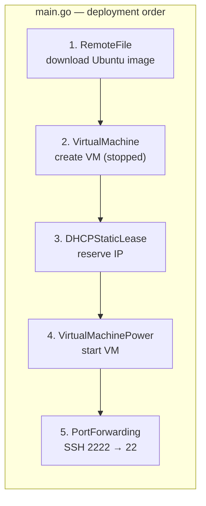

# Example Pulumi program — `opaq/bootstrap/pulumi-go`

Reference stack that provisions an Ubuntu VM on a Freebox using this provider. The program uses a **hand-written local SDK** (`freebox/*.go`) that calls `pulumi.RegisterResource` with the same tokens as the provider.

## Stack files

| File | Role |
|------|------|
| `Pulumi.yaml` | `name: opaq-bootstrap`, `runtime: go` |
| `Pulumi.<stack>.yaml` | Provider config (`freebox:*`) + stack variables (`opaq-bootstrap:vm_*`) |
| `main.go` | Orchestrates resources and exports outputs |
| `freebox/*.go` | Thin wrappers around `ctx.RegisterResource("freebox:…", …)` |

## Deployment graph (main.go)



Each step calls `freebox.New…`, which registers a resource with the Pulumi engine. The engine then invokes the **provider plugin** to apply changes on the box.

## Resource mapping

| Call in `main.go` | Provider token | Provider implementation |
|-------------------|----------------|-------------------------|
| `freebox.NewRemoteFile` | `freebox:downloads:File` | `resource_remote_file.go` |
| `freebox.NewVirtualMachine` | `freebox:virtual:Machine` | `resource_virtual_machine.go` |
| `freebox.NewDHCPStaticLease` | `freebox:dhcp:StaticLease` | `resource_dhcp_static_lease.go` |
| `freebox.NewVirtualMachinePower` | `freebox:virtual:MachinePower` | `resource_virtual_machine_power.go` |
| `freebox.NewPortForwarding` | `freebox:fw:PortForwarding` | `resource_port_forwarding.go` |

## Example stack configuration

```yaml
# Pulumi.freebox-go.yaml (excerpt)
config:
  freebox:endpoint: "https://<freebox_api_url>"
  freebox:apiVersion: "v9"
  freebox:appId: "terraform-provider-freebox"
  freebox:token:
    secure: v1:...
  opaq-bootstrap:vm_img_url: "http://.../ubuntu-...-arm64.img"
  opaq-bootstrap:vm_cloudinit_userdata: |
    #cloud-config
    ssh_authorized_keys:
      - ...
```

## How RegisterResource connects to the provider

```go
// freebox/port_forwarding.go (simplified)
func NewPortForwarding(ctx *pulumi.Context, name string, args *PortForwardingArgs, opts ...pulumi.ResourceOption) (*PortForwardingState, error) {
    inputs := pulumi.Map{ /* enabled, targetIp, ports, ... */ }
    var resource PortForwardingState
    err := ctx.RegisterResource("freebox:fw:PortForwarding", name, inputs, &resource, opts...)
    return &resource, err
}
```

The token `freebox:fw:PortForwarding` must match what the provider registers in `pulumi-provider-freebox/main.go`:

```go
infer.Resource(PortForwarding{}),
```

## Exported outputs

`main.go` exports stack outputs after deployment:

- `vm_id`, `vm_mac`, `vm_hostname`
- `vm_ip`, `vm_ip_reserved`, `vm_ip_fallback`
- `vm_power_state`
- `ssh_src_port`

These come from resource attributes returned by the provider after each `Create` / `Update`.

## Machine vs MachinePower

This example follows the recommended split:

- **`VirtualMachine`** — VM configuration only; created with `status: stopped`.
- **`VirtualMachinePower`** — power state (`running`) applied after DHCP lease exists.
- **`PortForwarding`** — depends on VM + power so SSH forwarding targets a running guest.

See the provider [README](../README.md) for when to use `Machine` vs `MachinePower`.
