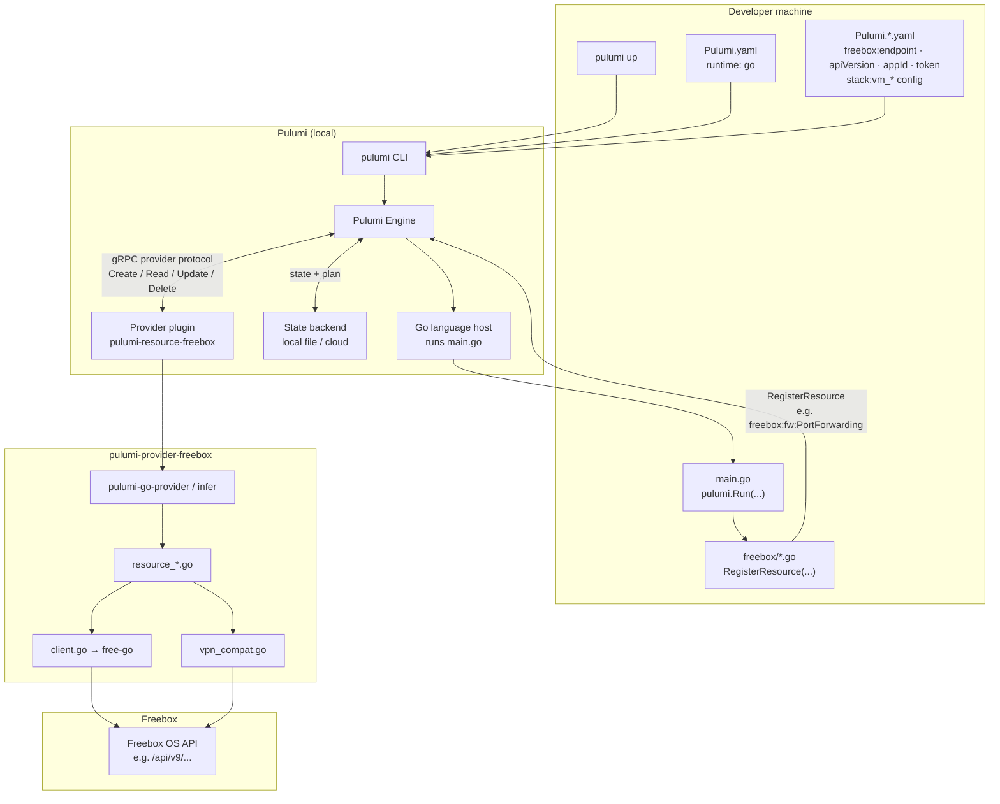
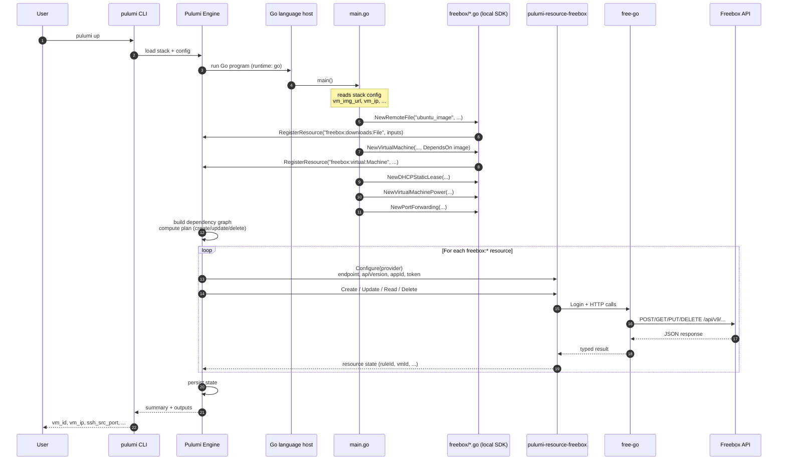
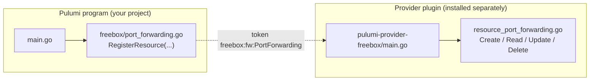
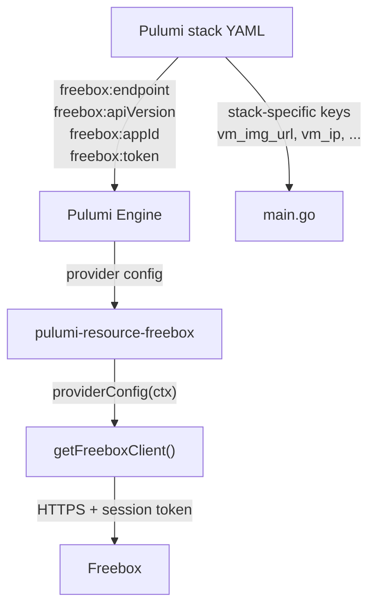

# Global stack — from `pulumi up` to Freebox

This diagram shows the full path when you run `pulumi up` on a Go Pulumi program that uses the Freebox provider (example: [opaq/bootstrap/pulumi-go](https://github.com/your-org/opaq/tree/main/bootstrap/pulumi-go)).

## Overview

## Detailed sequence (`pulumi up`)

## Program vs provider

## Configuration flow

## Authentication

The provider reads configuration from Pulumi provider config and/or environment variables:

| Pulumi config | Environment variable | Purpose |
|---------------|---------------------|---------|
| `freebox:endpoint` | `FREEBOX_ENDPOINT` | Box URL (default: `http://mafreebox.freebox.fr`) |
| `freebox:apiVersion` | `FREEBOX_VERSION` | API path version (default: `latest`) |
| `freebox:appId` | `FREEBOX_APP_ID` | Application ID |
| `freebox:token` | `FREEBOX_TOKEN` | Private API token |

`free-go` performs the login handshake (`/login` → `/login/session`) and sends `X-Fbx-App-Auth` on subsequent requests.
