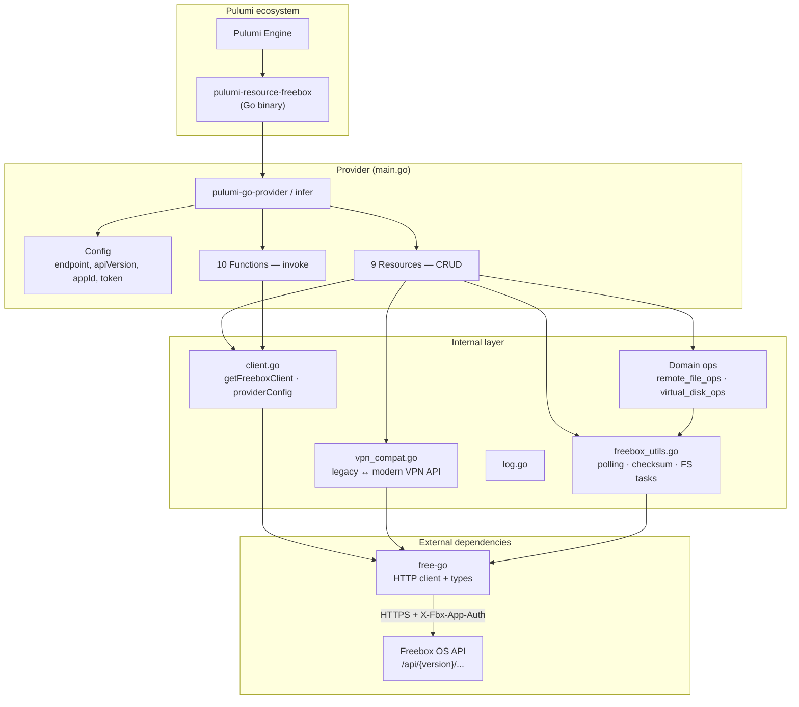
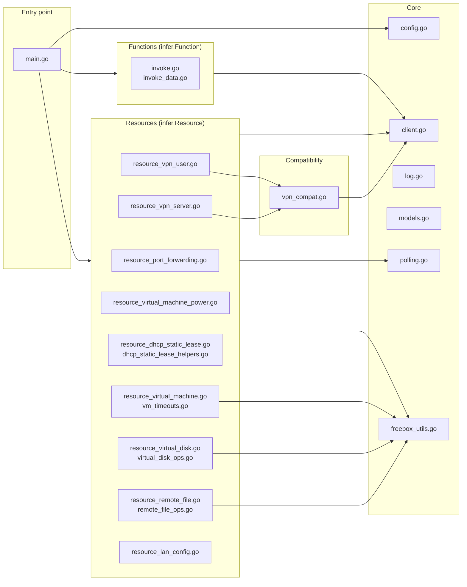
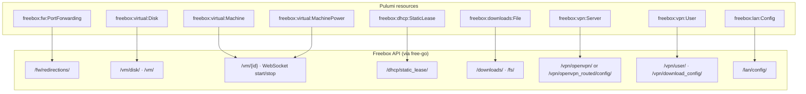
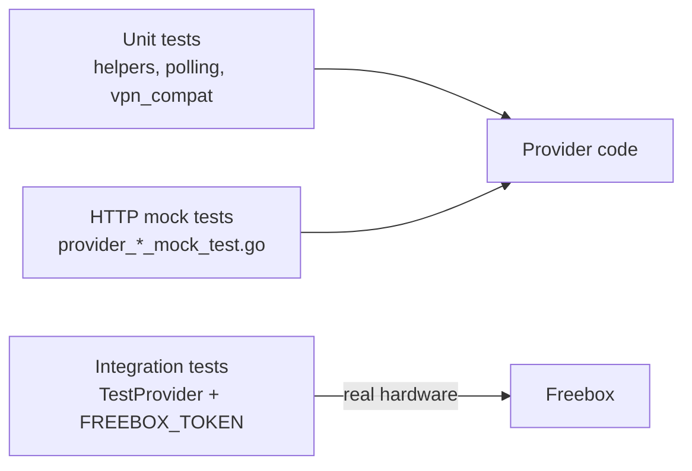

# Provider internals

Internal architecture of **pulumi-provider-freebox** (the `pulumi-resource-freebox` plugin).

## Layered view



## Source code layout



## Resources and Freebox API mapping



## Invoke functions (read-only)

| Token | Source | Purpose |
|-------|--------|---------|
| `freebox:api:Version` | `invoke.go` | API discovery (version, model, …) |
| `freebox:virtual:getVirtualDisk` | `invoke_data.go` | Disk metadata |
| `freebox:dhcp:getLease` / `getLeases` | `invoke_data.go` | DHCP static leases |
| `freebox:lan:getConfig` / `getInterfaces` / … | `invoke_data.go` | LAN browser |
| `freebox:virtual:getDistributions` | `invoke.go` | VM OS images |
| `freebox:system:getInfo` | `invoke.go` | System information |

Invokes call `getFreeboxClient` and `free-go` directly — no separate `*_ops.go` layer.

## Cross-cutting patterns

| Pattern | Files | Role |
|---------|-------|------|
| **infer CRUD** | `resource_*.go` | `Create` / `Read` / `Update` / `Delete` + `Args` / `State` types |
| **Shared client** | `client.go` | Merge Pulumi config + env → authenticated `free-go` client |
| **Async polling** | `polling.go`, `freebox_utils.go` | Wait for FS tasks, uploads, downloads, VM disk jobs |
| **VPN compat** | `vpn_compat.go` | Detect legacy VPN API (404 on `/vpn/openvpn/`) → modern paths (`openvpn_routed`, `download_config`); enable server + wait for `started`; recreate user on password change |
| **Domain ops** | `*_ops.go` | Non-trivial logic kept out of CRUD handlers |
| **Logging** | `log.go` | Debug log file (`FREEBOX_DEBUG_LOG`) |

## VPN resource lifecycle (example)

```mermaid
sequenceDiagram
    participant P as Pulumi Engine
    participant I as infer (VpnUser)
    participant C as getFreeboxClient
    participant V as vpn_compat
    participant F as free-go
    participant B as Freebox

    P->>I: Create / Update / Read / Delete
    I->>C: providerConfig(ctx)
    C->>F: Login (appId + token)
    F->>B: POST /login/session

    alt Create
        I->>V: createVPNUserCompat
        V->>F: POST /vpn/user/
        I->>V: getVPNUserClientConfigCompat
        V->>V: ensureOpenVPNServerReady (modern API)
        V->>B: GET download_config/...
    end

    alt Update (modern API)
        I->>V: updateVPNUserCompat
        Note over V: PUT password often returns inval;<br/>fallback: DELETE + POST (recreate)
        I->>V: getVPNUserClientConfigCompat
    end

    I-->>P: State (login, password, ovpnConfig, description*)
```

\* `description` is kept in Pulumi state only; the modern Freebox VPN user API does not persist it.

## Modern vs legacy VPN API

The provider does **not** require `apiVersion: v4`. It uses whatever version you configure (`latest`, `v9`, …).

| Legacy (`free-go` default paths) | Modern (recent Freebox OS) |
|----------------------------------|----------------------------|
| `GET /vpn/openvpn/` | `GET /vpn/openvpn_routed/config/` |
| `GET /vpn/user/{login}/config/openvpn` | `GET /vpn/download_config/{server}/{login}` |
| `PUT /vpn/user/{login}` with login + password | Password-only update often fails → recreate user |

Detection: `GET /vpn/openvpn/` returns `invalid_request` (404) → switch to modern paths in `vpn_compat.go`.

Optional env: `FREEBOX_VPN_SERVER` (default: `openvpn_routed`).

## Testing architecture



| Layer | Requires | Coverage |
|-------|----------|----------|
| Unit + mocks | Nothing | ~27% (CI-friendly) |
| Integration | `FREEBOX_TOKEN`, optional `FREEBOX_TEST_*` | ~40–45% |
